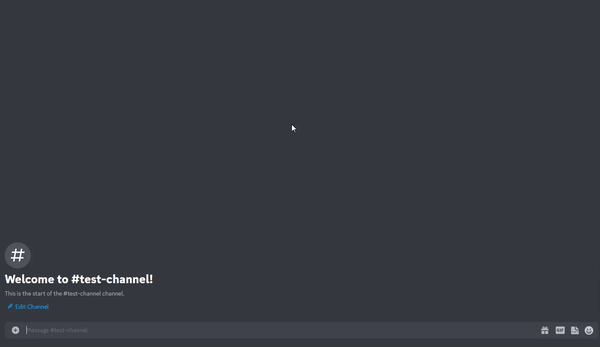

# SQLoad
A Discord bot made for assisting on the concepts of Datamodelling and Databases using OpenAI and Python.

<p align="center">

</p>

## Adding bot to your server
You can add the bot to your server using this [link](https://discord.com/api/oauth2/authorize?client_id=1052717746238005310&permissions=274877975552&scope=bot). **NOTE**: You need to have the required permissions (`manage server`/`administrator`) to be able to add the bot to your required server.

## Usage

- **BOT PREFIX** : `;` _you can use this to execute the bot commands (example - `;help`)_

To know the commands of the bot start by typing in `;help` - This will list out all the available commands this bot has till now.

For example - if you would like to convert a **natural text** to its equivalent **SQL query** you can do so as 
1. typing `;texttosql` - which will prompt for a database and then a query
2. feed the database -
```
employee(person_name, street, city)
works(person_name, company_name, salary)
company(company_name, city)
manages(person_name, manager_name)
```
3. enter the natural language text query to convert to SQL query -
```Find the names and the cities of residence of all employees who work for First Bank Corporation```

4. The bot should generate an SQL query -
```sql
SELECT person_name, city
FROM employee, works, company
WHERE employee.person_name = works.person_name AND works.company_name = company.company_name AND company.company_name = 'First Bank Corporation'
```


## Commands
Currently there are these commands available to execute on the server
1. `;help` - List out the basic description of the bot and the available commands on it.
    ##### SQL TASKS
2. `;texttosql` - prompts for a database and a query, then generates a SQL response query.
3. `;sqltotext` - prompts for a SQL query, then translates it into its natural language.
    ##### DATALOG TASKS
4. `;datalogtotext` - prompts for a datalog query, then translates it into its natural language.
    ##### TUPLE RELATIONAL CALCULUS TASKS
5. `;trctotext` - prompts for a TRC query, then translates it into its natural language.
    ##### MISC
6. `;creator` - gives a little detail about me in case you want to contact :information_desk_person:

## How it works

The bot uses [OpenAI API](https://openai.com/api/) to generate the required queries from the given prompts, the bot has been coded using [Python 3.9.9](https://www.python.org/) which was then implemented as a discord bot. 

**NOTE:** The answers generated the bot are done using **OpenAI API GPT-3 Model** engine and might not always generate correct response. However the answers generated are mostly precise and accurate to the actual answer _(if they differ)_ and are constantly being improved. 

To communicate with discord, this bot uses the [discord.py](https://discordpy.readthedocs.io/en/stable/) open-source library and its discord's API.

## Hosting
Currently this bot is being hosted on [Heroku](https://www.heroku.com/). To host it on your own machine, make sure you download the repository and install all the dependencies on `requiremments.txt`. Change the enviroment variables in `.env.example` accordingly and rename it as `.env`

You can run the bot using your terminal
```console
python3 bot.py
```